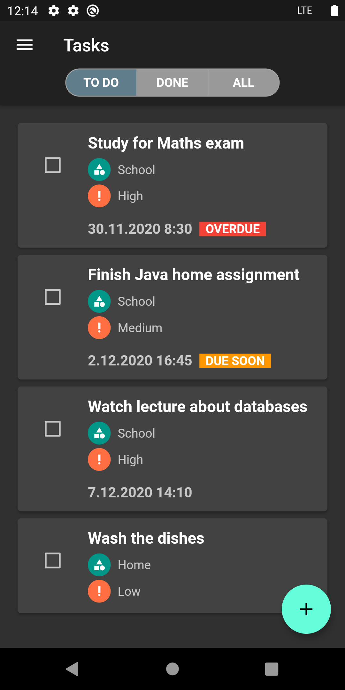

# To-Do App

To-Do App is written in Flutter for both Android and iOS.

#### To-Do App is simple and awesome app to organize your tasks.

User can register and make an account for himself in order to sync data to backend (https://taltech.akaver.com/).
It's also possible to use the app without registering.

Features:

* Create, view, edit and delete **todos**, **categories** and **priorities**

* Deleting and editing todos, categories and priorities by **swiping**

* Changing tasks, categories and priorities order via **drag-drop**

* **Marking** todos done/not done in list

* **Filtering** todos by status (not done, done, all)

* **Changing theme** (light to dark and vice versa) at runtime

* Works **offline** with local **SQLite** database

* **Register** a new account

* **Login** and **logout**

* **Sync** to ASP.NET Core 3 backend

 

Todo tasks | Done tasks | All tasks
------------ | ------------- | -------------
 |  | 

Add task | Edit task | Delete task
------------ | ------------- | -------------
 |  | 

Priorities | Categories 
------------ | ------------- 
 | 

Register | Login | Account
------------ | ------------- | -------------
 |  | 

Menu - dark theme | Menu - light theme 
------------ | ------------- 
 | 
